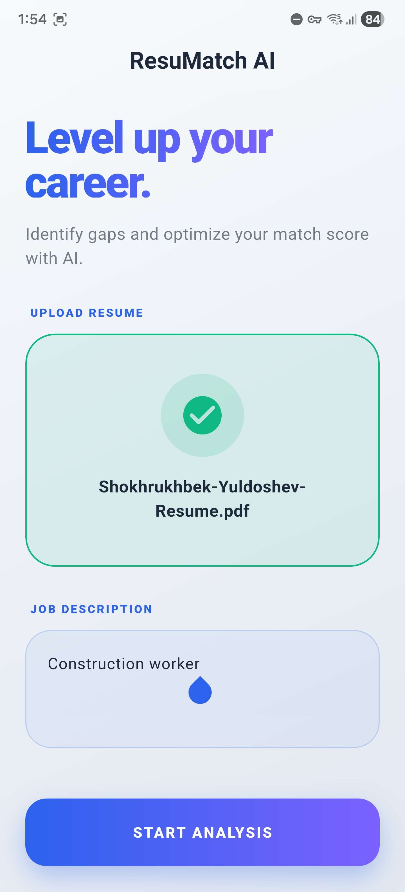
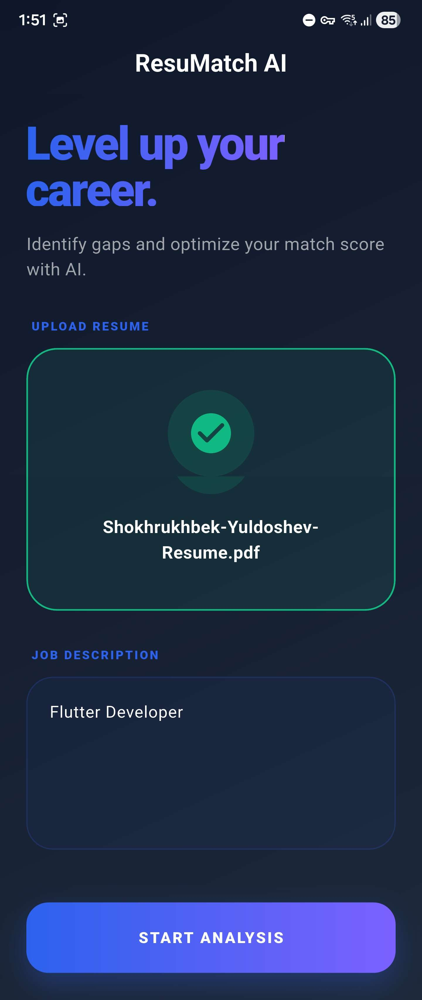
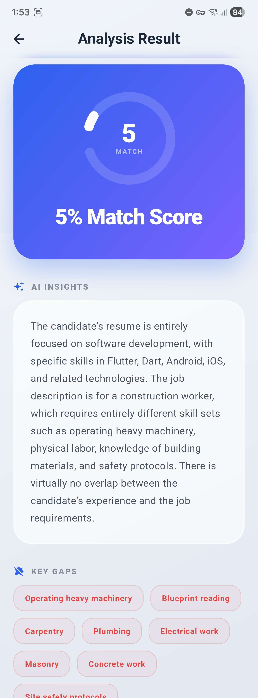
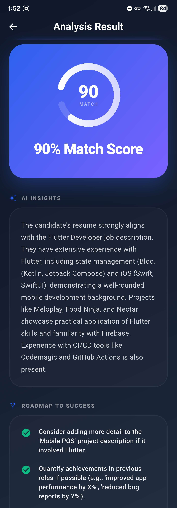

# ResuMatch

**ResuMatch** AI is a high-performance Flutter application designed to bridge the gap between job seekers and their professional goals. By leveraging **Gemini 2.5 Flash Lite** via **Firebase AI**, the application provides instant, intelligent analysis of resumes against specific job descriptions.

## Screenshots

### Home Screen

|                        Light Mode                         |                        Dark Mode                         |
| :-------------------------------------------------------: | :------------------------------------------------------: |
|  |  |

### Results Screen

|                          Light Mode                          |                          Dark Mode                          |
| :----------------------------------------------------------: | :---------------------------------------------------------: |
|  |  |

## Key Features

- **AI Resume Analysis**: Utilizes Gemini 2.5 Flash Lite for rapid text processing and skill extraction.
- **Firebase AI Integration**: Securely powered by `firebase_ai` to handle authentication and model interaction without client-side API keys.
- **Dynamic UI**: Features smooth animations, haptic feedback, and a reactive state-driven analysis flow.
- **PDF Integration**: Direct text extraction from uploaded resume files.
- **Actionable Insights**: Provides a percentage match score, identified strengths, and a list of missing keywords or skills.

## Tech Stack

- **Frontend**: Flutter (Dart)
- **State Management**: Bloc / Cubit
- **Backend**: Firebase (Gemini AI)
- **AI Model**: Gemini 2.5 Flash Lite

## Getting Started

### 1. Firebase Setup

1. Create a new project in the [Firebase Console](https://console.firebase.google.com/).
2. Enable **Gemini AI** (Gemini AI for Firebase) in the Firebase sidebar under the Build section.
3. Add your Android and iOS applications to the project.

### 2. Local Configuration

Ensure the [Firebase CLI](https://firebase.google.com/docs/cli) is installed, then execute:

```bash
flutterfire configure
```

This command generates the `firebase_options.dart` file and links the application to the specified project.

### 3. Running the Application

```bash
# Install dependencies
flutter pub get

# Launch on device or emulator
flutter run
```

## Contributing

Pull requests are welcome. For major changes, please open an issue first to discuss the proposed updates.

## License

Distributed under the Attribution-NonCommercial-ShareAlike 4.0 International License. See [LICENSE](https://www.google.com/search?q=LICENSE) for more information.

## Contact

- [Email](mailto:shokh.xyz@gmail.com)
- [GitHub](https://github.com/ShokhrukhbekYuldoshev)

## Show your support

Give a star if you find this project useful.
